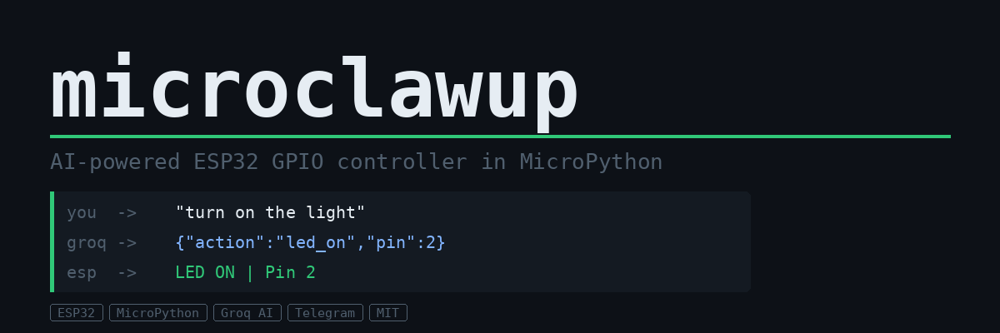

# microclawup

> AI-powered ESP32 GPIO controller in MicroPython.
> Control your hardware with natural language via Telegram — powered by Groq AI.

```
"turn on the light"  ->  LED ON | Pin 2
"blink 5 times"      ->  Blink x5 | Pin 2
"pin 4 high"         ->  GPIO HIGH | Pin 4
```

---

## How it works

```
Telegram -> Groq AI -> JSON command -> ESP32 GPIO -> Telegram reply
```

You send a natural language message on Telegram. Groq AI converts it to a JSON hardware command. ESP32 executes it and replies back.

---

## Features

- Natural language GPIO control — English and Hindi both work
- Persistent memory — pin states are saved across reboots
- /status command — see all pin states anytime
- /help command — see all available commands
- WiFi auto-reconnect — bot stays online even if WiFi drops
- Lightweight — runs comfortably on ESP32 with MicroPython

---

## Requirements

- ESP32 board (ESP32-C3, S3, or C6 recommended)
- MicroPython firmware flashed on ESP32
- Python 3 on your PC (for setup)
- Free Groq API account
- Telegram bot

---

## Quick Start

### 1. Get your credentials

| What | Where |
|------|-------|
| Groq API Key | https://console.groq.com -> API Keys |
| Telegram Bot Token | @BotFather on Telegram |
| Telegram Chat ID | @userinfobot on Telegram |

### 2. Clone the repo

```bash
git clone https://github.com/kritishmohapatra/microclawup
cd microclawup
```

### 3. Run setup

```bash
python setup.py
```

This will ask for your credentials and generate microclawup/config.py automatically.

### 4. Upload to ESP32

Open Thonny IDE:
1. Connect your ESP32
2. Upload the entire microclawup/ folder to ESP32
3. Upload main.py to the root of ESP32
4. Reset ESP32

### 5. Done!

Your Telegram bot will send "MicroClawUP Online" when ready.

---

## Telegram Commands

| Command | Result |
|---------|--------|
| turn on the light | LED ON | Pin 2 |
| turn off the light | LED OFF | Pin 2 |
| blink 5 times | Blink x5 | Pin 2 |
| pin 4 high | GPIO HIGH | Pin 4 |
| pin 4 low | GPIO LOW | Pin 4 |
| /status | Shows all pin states |
| /help | Shows command list |

Natural language works in English and Hindi — Groq AI understands both!

---

## Persistent Memory

microclawup saves all pin states to flash storage automatically. Even after a reboot, your ESP32 remembers the last state of every pin.

Use /status anytime to check current pin states:

```
PIN STATUS
Pin 2: ON
Pin 4: HIGH
Pin 5: LOW
```

---

## File Structure

```
microclawup/
├── main.py
├── setup.py
├── config.example.py
├── .gitignore
└── microclawup/
    ├── ai.py
    ├── agent_core.py
    ├── hal.py
    ├── telegram.py
    ├── storage.py
    ├── wifi.py
    └── __init__.py
```

---

## Hardware

Tested on:
- ESP32

Default LED pin is 2. Change in your commands or modify hal.py.

---

## License

MIT — free to use, hack, and share!

---

Made with love by **Kritish Mohapatra**

---

## Support

If you find microclawup useful, consider giving it a star on GitHub!
It helps others discover the project.

[](https://github.com/kritishmohapatra/microclawup)

If you want to support development:

[](https://github.com/sponsors/kritishmohapatra)